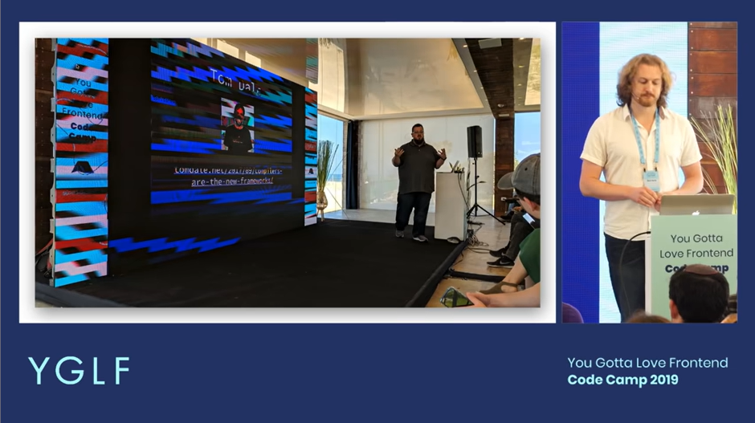

## Svelte 3 : 반응성(reactivity)에 대해 다시 생각하기

마침내

---

https://svelte.dev/blog/svelte-3-rethinking-reactivity

[Rich Harris](https://twitter.com/Rich_Harris), 2019년 4월 22일

여러달이 지난 후에 마침내 우리는 Svelte 3의 안정화 릴리즈를 발표합니다. 이 거대한 릴리즈는 Svelte 커뮤니티의 수많은 사람들과 그들으 수백 시간의 작업을 의미합니다. 물론 모든 단계에서 설계에 대한 도움이 된 베타 테스터들의 귀중한 피드백도 포함해서 말이죠.

정말 좋아할 거라고 생각합니다.

### Svelte가 뭐죠?

Svelte는 React나 Vue 같은 컴포넌트 프레임워크지만 중요한 차이점이 있습니다. 전통적인 프레임워크들에선 선언적이고 상태에 의해 변하는 코드를 작성할 수 있습니다. 하지만 문제가 있죠, 브라우저가 그 선언적인 구조를 DOM 연산으로 바꾸기 위해 별도의 작업을 해야한다는 겁니다. [가상 DOM 비교](https://svelte.dev/blog/virtual-dom-is-pure-overhead)([번역](./virtual-dom-is-pure-overhead.md)) 같은 기술을 사용해 프레임에 부담을 주고 가비지 컬렉터를 무겁게 만듭니다.

대신 Svelte는 빌드 시간에 동작합니다. 컴포넌트를 고가용성의 선언적 코드로 만들어줍니다. 거기서는 DOM이 외과적으로(surgically) 업데이트됩니다. 즉, 훌륭한 성능을 지니는 야심찬 어플리케이션을 작성할 수 있죠.

Svelte의 첫 버전은 [가설에 대한 실험](https://svelte.dev/blog/frameworks-without-the-framework)([번역](./frameworks-without-the-framework.md))에 대한 것이었습니다. 이 때 만들어진 컴파일러는 훌륭한UX를 제공하는 견고한 코드를 만들 수 있었습니다. 두 번째는 약간의 정돈만한 작은 업그레이드였습니다.

버전 3는 중요한 오버홀입니다. 지난 5~6달간 우리는 몹시 훌륭한 개발 경험을 만드는데 집중했습니다. 이제 당신이 본 그 어떤 것보다 [엄청나게 적은 보일러플레이트](https://svelte.dev/blog/write-less-code)([번역](./write-less-code.md))로 컴포넌트를 작성할 수 있습니다. 완전히 새로운 [튜토리얼](https://svelte.dev/tutorial/basics)을 체험해보고 우리가 뜻하는 바를 확인해 보세요. 다른 프레임워크에 익숙하다면 놀랍도록 기뻐할 것입니다.

이를 위해 우리는 우선 현대 UI 프레임워크의 중점이 무엇인지 다시 생각해보았습니다. 바로 반응성(reactivity)였습니다.

`[YouTube](https://youtu.be/AdNJ3fydeao)`



[You Gotta Love Frontend Code Camp](https://www.israel.yglfconf.com/) '반응성에 대해 다시 생각하기'

### 반응성을 언어로 이동

과거 Svelte에서는 `this.set` 메서드를 호출해 컴퓨터에게 상태가 변했다고 알릴 수 있었습니다.

```js
const { count } = this.get();
this.set({
  count: count + 1,
});
```

이러면 컴포넌트가 *반응 - react*하게 됩니다. 말하자면 `this.set`은 거의 고전적인(pre-hook) React에서 쓰이는 방법이던 `this.setState` 메서드와 동일한 거죠.

```js
const { count } = this.state;
this.setState({
  count: count + 1,
});
```

기술적인 차이가 있지만(위의 비디오에서 제가 설명했듯이, React는 반응적이지 않습니다), 개념적으로는 동일합니다.

[hook](https://reactjs.org/docs/hooks-intro.html)의 도래로 모든 게 바뀌었습니다. 그 상태를 다루는 매우 다른 방식 말이죠. 많은 프레임워크가 스스로의 hook 구현을 실험중이지만 그 것이 우리가 원하던 방향이 아니라고 빠르게 결단을 내렸습니다. hook은 꽤 흥미롭기도한 동시에 자연스럽지 못한 코드이고 가비지 컬렉터에게 불필요한 일을 하게 만듭니다. [임베디드 장치](https://mobile.twitter.com/sveltejs/status/1088500539640418304) 수많은 애니메이션 상호작용이 있는 곳에서 쓰이는 프레임워크에게는 좋지 못한 것입니다.

> 사실 Svelte 3는 기본적으로 [Sunil의 잘못](https://twitter.com/threepointone/status/1057179801109311488)입니다.

그래서 우리는 한 걸음 물러나서 스스로에게 물었습니다. 어떤 API가 우리에게 적합할까... 그리고 최고의 API는 API가 전혀 없는 것이라는 걸 깨달았습니다. 우리는 그냥 그 언어를 사용하면 됩니다. `count` 값을 업데이트하는 건 다음과 같습니다.

```js
count += 1;
```

우리(Svelte)는 컴파일러기에 뒤에서 할당문을 만듦으로써 이 것이 가능합니다.

```
count += 1; $$invalidate('count', count);
```

중요한 건 그 어떤 프록시나 접근자 사용의 복잡성과 오버헤드 없이 이러한 것들을 해낼 수 있다는 겁니다. 엄청난 겁니다.

### 새로운 모습

컴포넌트만이 완전히 변한 유일한 것이 아닙니다. Svelte는 스스로 완전히 새로운 룩앤필을 가지게 되었습니다. 새 로고와 웹사이트([svelte.technology](https://svelte.technology/) => [svelte.dev](https://svelte.dev/))를 제작한 [Achim Vedam](https://vedam.de/)의 놀라운 설계 작업덕분이죠.

슬로건도 '마법과 같이 사라지는 UI 프레임워크(The magical disappearing UI framework)'에서 '사이버네틱하게 강화된 웹앱(Cybernetically enhanced web apps)'으로 바꾸었습니다. Svelte는 압도적인 퍼포먼스, 작은 사이즈의 번들, 접근성, 빌트인 스타일 캡슐화, 선언적인 전환, 쉬운 사용성, 그리고 컴파일러라는 사실 등, 다양한 면을 갖고 있습니다. 그 중 하나에 집중하는 게 다른 쪽에는 불공평해 보일 정도로 말이죠. `사이버네틱하게 강화된`은 Svelte의 가장 중요한 철학을 나타냅니다. 우리의 도구가 스스로 지성을 가지고 확장함으로써 동작해야한다는 걸 말이죠. 레트로한 윌리엄 깁슨 풍의 반전을 희망하면서.

### version 2로부터 업그레이드

이미 Svelte 2의 사용자라면 손수 업그레이드를 할 필요 없습니다. 곧 해당 프로세스를 자동화할 마이그레이션 가이드와 [svelte-upgrade](https://github.com/sveltejs/svelte-upgrade)의 업데이트된 버전을 릴리즈할 겁니다. 하지만 많은 것이 변했고 모든 것이 자동으로 다루어지진 않을 겁니다.

우리는 이 걸 가볍게 받아들이지 않습니다. Svelte 3를 경험하고 나면 왜 우리가 과거와 멀어질 필요가 있었는지 이해할 것입니다.

### 여전히 진행중

이번 릴리즈가 힘들었지만 아직 끝의 근처에도 가지 못했습니다. 우리는 좀 더 똑똑하고 컴팩트한 코드를 만드는데 수많은 생각을 하고 있습니다. 그리고 긴 원하는 기능 목록도요. 우리의 Next.js 스타일으 앱 프레임워크 [Sapper](https://sapper.svelte.dev/)는 여전히 Svelte 3를 사용하도록 업데이트 중입니다. [Svelte Native](https://svelte-native.technology/) 커뮤니티 프로젝트는 Svelte로 Android와 iOS 앱을 작성할 수 있게 해줍니다. 탄탄하게 진행중이지만 핵심부터 여전히 더 완전한 지원이 필요합니다. 우린 아직 다른 프레임워크가 지닌 풍부한 에디터 확장, 문법 강조, 컴포넌트 킷, 개발자 도구를 보유하고 있지 않습니다. 해결해야할 문제입니다. 그리고 우리는 퍼스트 클래스의 Typescript 지원을 굉장히 바라고 있습니다.

아직 Svelte 3가 웹앱을 만드는데 최고의 방법이라고 생각합니다. 한 시간 정도 투자해서 [튜토리얼](https://svelte.dev/tutorial)을 해보세요. 당신도 같은 생각을 갖길 바랍니다. 또한 [디스코드 채팅방](https://svelte.dev/chat)과 [GitHub](https://github.com/sveltejs/svelte)도 누구에게나, 특히 당신을 위해 열려있습니다.
