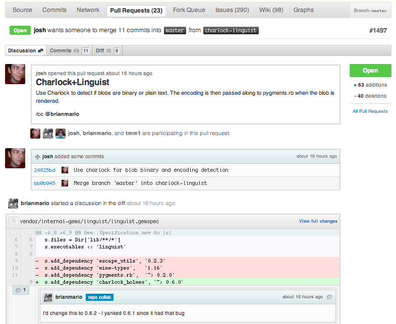
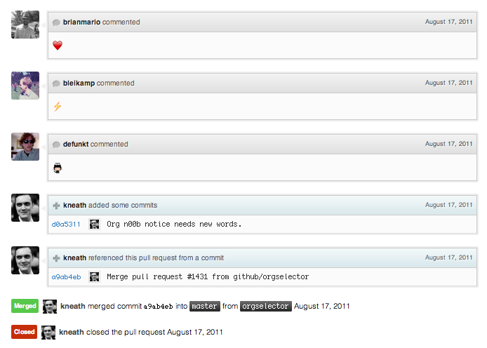

<!-- @format -->

원문 : [GitHub Flow](http://scottchacon.com/2011/08/31/github-flow.html)

참고1 : [5분 안에 이해하는 GitHub flow](https://guides.github.com/introduction/flow/)

# GitHub Flow


#### Scott Chacon (2011년 8월 31일)

<br/>

## git-flow의 문제점

수업이나 워크샵 등에서 git을 전파하러다니던 중 누군가 내게 git-flow에 대해 어떻게 생각하냐고 물었다. 나는 항상 git-flow는 굉장히 유연하고 직관적이며 훌륭하다고 대답한다. git-flow는 마치 표준처럼 받아들여지고 있고 많은 개발자들이 이 표준화된 워크플로우에 익숙해지고 있다.

하지만 문제점이 없는 건 아니다. 많은 사람들이 master 브랜치가 아닌 develop 브랜치로부터 새 feature 브랜치를 따는 것이나 핫픽스 처리 방식 등에 꽤나 불만을 가지고 있었다. 물론 이런 것들은 그냥 사소한 것들이다.

내가 보기에 가장 큰 문제점은 git-flow가 대부분의 개발자들이 팀들이 생각하는 것 이상으로 복잡하다는 점이다. 커다란 헬퍼스크립트, [git flow](https://github.com/nvie/gitflow)가 존재하는 것이 그 증거다. 해당 헬퍼 스크립트는 훌륭하지만 결국 사용자가 git GUI 클라이언트가 아닌 커맨드라인을 쓰게끔 강요한다는 단점이 존재한다. 이런 커맨드라인 환경에 익숙하지 않은 개발자에게는 굉장히 큰 문제가 되고 독이 되고 있다.

간단한 워크플로우로 이런 문제를 해결할 수 있다. GitHub(글쓴이가 작성시 GitHub에서 Ruby 개발자로 일했음)에서 우리는 git-flow를 쓰지 않는다. 우린느 항상 더 단순한 git 워크플로우를 사용해 왔다.

워크플로우의 단순함은 많은 이점을 가져다주는데 하나는 사람들이 이해하기 쉽다는 것이다. 이해하기 쉽기 때문에 일처리가 빨라지고 복잡한 함정에 빠지는 일도 적어 잘못한 걸 되돌리는 일도 거의 없어진다. 다른 이점은 위에서 언급한 래퍼 스크립트(git flow)가 필요없다는 점이다. 그 때문에 GUI툴을 사용해도 워크플로우를 적용하는데 전혀 문제 없다.

## GitHub Flow

왜 GitHub에서 git-flow를 쓰지 않느냐고 물을 수도 있다. 가장 큰 이유는 엄청나게 자주 배포하기 때문이다. git-flow 프로세스는 "릴리즈"에 특화되도록 설계되어있다. 우리는 하루에 몇 번씩이나 배포를 하기 때문에 실질적으로 "릴리즈"라는 건 존재하지 않는다. CI 등의 결과는 채팅방의 봇으로 전달 받는다. 테스팅과 패키징을 가능한 간단히 유지하기에 모든 직원들이 이에 대해 딱히 부담을 느끼지 않는다.

이렇게 자주 배포하는 건 여러 장점이 있다. 몇시간마다 배포하면 큰 버그가 여럿 생기는 일이 거의 없을 것이다. 작은 문제가 생길 수도 있겠지만 금방 재배포 되므로 금방 고쳐진다. 이에 대해서 git-flow에서는 핫핏스를 진행하지만 GitHub Flow에서는 따지고 보면 이는 일상적인 프로세스의 일부에 불과하다. 그렇기에 GitHub Flow에서는 핫픽스와 매우 작은 기능의 추가는 똑같은 일이나 마찬가지다.

이렇게 배포하는 것의 또 다른 이점은 모든 이슈를 빠르게 다룰 수 있다는 점이다. 보안 이슈나 매우 작지만 쓸만한 기능의 빠른 추가에 빠르게 반응할 수 있다. 또한 이런 문제를 다룰 때 일반적인 기능 추가처럼 똑같은 프로세스를 사용하기에 몹시 간단하다.

## 어떻게 동작하는가?

그래서 GitHub Flow가 무엇이냐고? 다음 여섯 가지를 지키는 워크플로우를 의미한다.

- master 브랜치의 모든 커밋은 항상 배포 가능해야한다.
- 새로운 무언가를 하기 전에 master로부터 브랜치를 딴다. 이 때 브랜치의 이름은 '무언가'를 정확히 나타내야한다(가령, 카카오톡 로그인 기능을 추가한다고 하면, new-login-method-kakao 같은 식으로)
- 브랜치를 로컬에서 커밋하고 주기적으로 리모트 서버의 동일한 브랜치에 푸쉬한다.
- 피드백이나 도움이 필요할 때, 혹은 이 브랜치가 머지 되어야한다는 생각이 들 때 PR(Pull Request)를 연다.
- 승인이 떨어지면 master에 머지한다.
- 머지되고 master로 푸쉬되면 바로 배포한다.

이 게 전부다. 몹시 간단하고 효율적이다. 현재 GitHub 내 15~35명의 어느정도 규모가 있는 개발팀에서 운용중이다. 실제 소스코드로 협업을 하는 개발팀은 대략 이 정도 규모일 것이다.

각 단계를 자세히 살펴보자.

### 1. master 브랜치의 모든 커밋은 항상 배포 가능 해야한다.

이 것이 GitHub Flow에서 강요하는 단 하나의 규칙이다. 'master'는 오직 하나만 존재하고 항상 배포될 수 있어야한다. 최악의 경우라도 수시간 내에는 배포 가능한 상태를 만들어내야한다. master가 이전 커밋으로 돌아가는 일은 거의 벌어지지 않는다. 새 커밋이 만들어지는 한이 있더라도 롤백은 없다.

master 브랜치는 안정적이며 항상 배포가 가능해야한다. 그로부터 나오는 브랜치도 마찬가지다. 만일 master로 테스트 되지 않거나 빌드를 깨는 무언가가 푸쉬된다면 팀의 규칙을 깬 것이고 개발자의 기분이 좋지 않을 수도 있다. 우리가 푸쉬하는 모든 브랜치는 테스트를 거치며 채팅방에 자동으로 보고된다. 이 브랜치들의 성공여부는 Jenkins 같은 툴을 통해 검증된다.

별도의 배포 브랜치를 딸 수도 있겠지만 우리는 그러지 않는다. 단순히 현재 배포된 SHA를 웹앱에 노출하고 비교할 때만 그 걸 활용한다.

### 2. master로부터 명확한 브랜치를 만든다.

뭔가 새 작업을 하고 싶다면 안정화된 master로부터 명확한 이름의 브랜치를 딴다. 가령, GitHub 프로젝트에서는 프로젝트에는 ‘user-content-cache-key’, ‘submodules-init-task’, 또는 ‘redis2-transition’ 등의 브랜치가 존재한다. 이를 통해 몇 가지 이점을 누릴 수 있는데 하나는 fetch 했을 때 다른 사람들이 무슨 일을 하는지 브랜치를 통해 바로 확인할 수 있다는 점이다. 다른 하나는 해당 브랜치를 잠시 냅두고 다른 작업을 할 때 그 브랜치가 어떤 작업중이었는지 쉽게 기억할 수 있다는 점이다.

또한 GitHub의 브랜치 리스트 페이지에 가면 팀에서 무슨 일이 이루어지는지 아래처럼 대략적으로 바로 파악할 수 있다.


이를 통해 프로젝트의 현 상태와 프로젝트에 앞으로 추가될 기능들을 간략하게 알 수 있다. 또한 브랜치 간 차이도 쉽게 알 수 있다.

이 글을 쓸 때 우리는 GitHub에 44개의 머지 되지 않은 브랜치가 있음을 확인할 수 있었고 9~10개 정도의 브랜치가 지난주에 푸쉬되었음을 알 수 있었다.

### 3. 지속적으로 해당하는 리모트 브랜치에 푸쉬

git-flow와 또 다른 큰 차이점은 서버에 존재하는 동일한 리모트 브랜치에 지속적으로 푸쉬를 한다는 것이다. 우리는 배포시점에는 master만 신경 쓰면 된다. 해당 리모트 브랜치를 서버에 푸쉬하는 건 다른 사람에게 아무 영향을 미치지 않는다. master에서 작업하는 게 아니기 때문이다.

이를 통해 어느정도의 백업효과를 기대할 수 있다. 또한 `git fetch`로 현재 프로젝트 내에서 해야할, 진행중인 일의 리스트도 간단히 파악할 수 있다.

```bash
$git fetch
remote: Counting objects: 3032, done.
remote: Compressing objects: 100% (947/947), done.
remote: Total 2672 (delta 1993), reused 2328 (delta 1689)
Receiving objects: 100% (2672/2672), 16.45 MiB | 1.04 MiB/s, done.
Resolving deltas: 100% (1993/1993), completed with 213 local objects.
From github.com:github/github
 * [new branch]      charlock-linguist -> origin/charlock-linguist
 * [new branch]      enterprise-non-config -> origin/enterprise-non-config
 * [new branch]      fi-signup  -> origin/fi-signup
   2647a42..4d6d2c2  git-http-server -> origin/git-http-server
 * [new branch]      knyle-style-commits -> origin/knyle-style-commits
   157d2b0..d33e00d  master     -> origin/master
 * [new branch]      menu-behavior-act-i -> origin/menu-behavior-act-i
   ea1c5e2..dfd315a  no-inline-js-config -> origin/no-inline-js-config
 * [new branch]      svg-tests  -> origin/svg-tests
   87bb870..9da23f3  view-modes -> origin/view-modes
 * [new branch]      wild-renaming -> origin/wild-renaming
```

위 정보는 언급한 것처럼 GitHub 브랜치 페이지에서 언제든지 볼 수 있다.

### 4. 언제든지 PR 열기

GitHub은 PR이라는 훌륭한 코드 리뷰 시스템을 보유하고 있다. 많은 사람들이 오픈소스 작업에서 PR을 쓴다. 프로젝트를 포크한다거나, 프로젝트를 업데이트한다거나, 또는 관리자에게 PR을 보내는 등의 일을 할 때 PR을 연다. 그러나 일반적인 내부 코드 리뷰 시스템으로도 사용할 수 있다.

PR은 브랜치에 관련된 작업보다 더 다양하게 쓰일 수도 있다. 그냥 브랜치 머지 요청에 추가로 "이 부분이 어려워", "잘 되지 않아" 같은 메시지를 보내 리뷰를 받는데도 PR을 열 수 있다.



여기서 Josh가 Brian을 리뷰어(cc)로 지정했다. 이를 통해 Brian으로부터 리뷰를 받고 코드에 대해 조언을 구할 수 있다. 이 과정에서 아래처럼 Josh는 Biran의 우려를 받아들이고 그에 대한 수정사항을 반영해 푸쉬를 계속 진행한다.


마침내 배포 직전으 트리이얼 단계에 도달했다. 해당 브랜치가 master가 아니기 때문에 배포가 준비된 상태는 아니다. 우리는 이처럼 실제 배포를 위해 master로 브랜치를 머지하기 전에 PR을 열어 코드 리뷰를 진행했다.

이처럼 작업중 뭔가 도움이나 조언이 필요하다거나, 디자이너의 리뷰가 필요하다거나, 아니면 코드 없이 스크린샷이나 아이디어 등을 공유할 때도 PR을 열 수 있다. 위처럼 특정인을 지정해 리뷰를 받을 수도 있다.

GitHub은 위처럼 대화방식을 적절히 시각화해서 보여주기에 이처럼 PR간 커밋 이력도 보기좋게 만들어 낸다.

만약 브랜치가 너무 오래 열려있거나 master에 비해 너무 오래되었다고 판단되면 머지를 진행해도 된다.


이 또한 그래픽으로 쉽게 확인할 수 있다.

### 5. PR 리뷰 후에 머지

당연히 master로의 머지는 바로 할 수 없다. 관리자에게 허락을 받아야한다.



머지가 된 후 PR을 닫는다. 자동으로 닫게끔 설정할 수도 있다.

### 6. 리뷰 후에 즉각 배포

마침내 작업이 끝났고 master 브랜치로 머지한 뒤 배포할 때다. 만약 바로 배포하지 못한다해도 이 작업은 수시간 내로 이루어져야 한다.


하루에 24번이나 배포한 게 보이는가?
