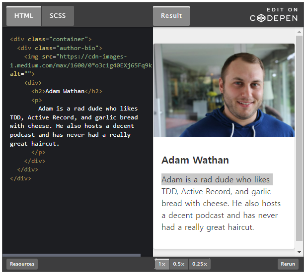
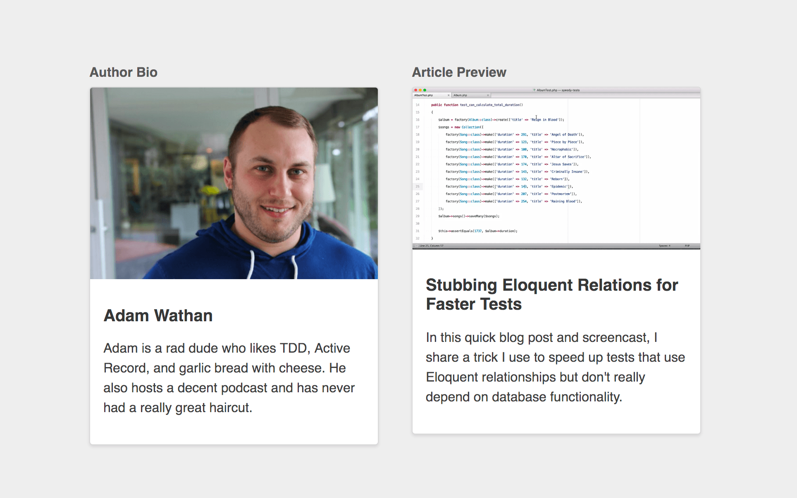
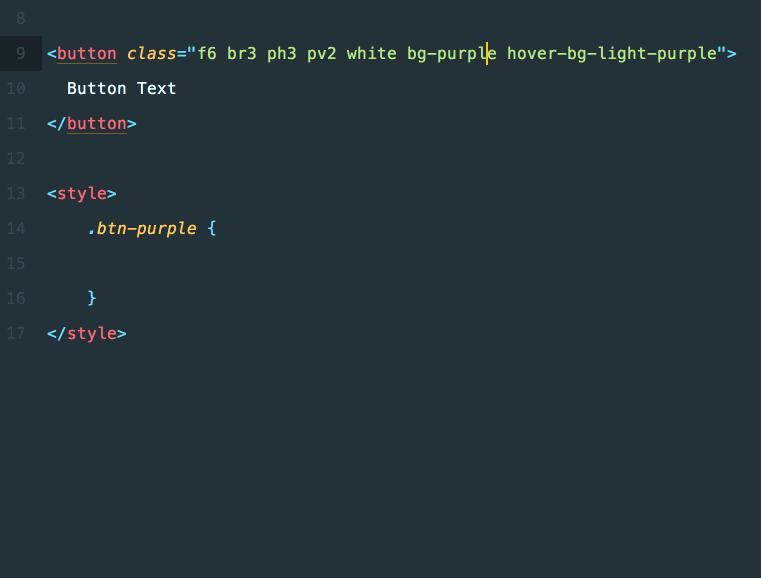

# CSS 유틸리티 클래스와 "관심사 분리(Separation of Concerns)"

https://adamwathan.me/css-utility-classes-and-separation-of-concerns/

TailWindCSS 개발자, Adam Wathan

2017년 8월 7일

지난 수년간 내가 CSS를 작성하는 방식은 "시맨틱"한 방식에서 "기능적인 CSS"라고 불리는 방식으로 바뀌었다.

이런 방식은 많은 개발자로부터 감정적인 반응을 끌어냈다. 그래서 이 자리를 빌려 어떻게 그간 어떤 과정을 거쳐 이런 관점을 지니게 되었는지에 대한 이야기, 그리고 추가적인 몇가지 교훈과 인사이트를 공유하려고 한다.

<br/>

## 페이즈 1: "시맨틱" CSS

어떻게 좋은 CSS를 작성하는지 배우려고 할 때 좋은 사례 중 하나로 듣게 되는 게 하나 있는데 바로 "관심사 분리(SOC)"이다.

이는 곧, HTML은 컨텐트에 관한 정보만을 포함하고 모든 스타일 결정은 CSS에서 이루어져야 한다는 것을 의미한다.

이 HTML을 살펴보자.

```HTML
<p class="text-center">
    Hello there!
</p>
```

`.text-center` 클래스가 보이는가? 텍스트를 중앙에 놓는 디자인 결정이다. 즉, 이 코드는 "관심사 분리"를 위반했다. 스타일 정보를 HTML에 넣었기 때문이다.

대신 권장되는 방법은 컨텐트에 기반한 이름의 클래스를 엘레멘트에게 부여하는 것이다. 그리고 마크업을 스타일링하기 위해 이 클래스를 CSS에서 연결고리으로 사용한다.

```HTML
<style>
.greeting {
    text-align: center;
}
</style>

<p class="greeting">
    Hello there!
</p>
```

이런 방식의 전형적인 예는 [CSS Zen Garden](http://www.csszengarden.com/)이다. 이 사이트는 "관심사 분리"를 한다면 스타일 시트를 바꾸는 것만으로도 디자인을 새롭게 할 수 있다는 것을 보여주기 위해 만들어졌다.

기존에 내 워크플로우는 다음과 같았다.

1. 새 UI에 필요한 마크업을 작성한다(예시로는 저자 소개 카드를 사용한다).

```HTML
<div>
  
  <div>
    <h2>Adam Wathan</h2>
    <p>
      Adam is a rad dude who likes TDD, Active Record, and garlic bread with cheese. He also hosts a decent podcast and has never had a really great haircut.
    </p>
  </div>
</div>
```

2. 컨텐츠에 기반해 설명적인 클래스를 추가한다.

```HTML
<div class="author-bio">
    
    <div>
      <h2>Adam Wathan</h2>
      <p>
        Adam is a rad dude who likes TDD, Active Record, and garlic bread with cheese. He also hosts a decent podcast and has never had a really great haircut.
      </p>
    </div>
  </div>
```

3. 마크업을 스타일링하기 위해 CSS/Less/Sass 내에 해당 클래스(`.author-bio`)를 연결고리로써 사용한다.

```CSS
.author-bio {
  background-color: white;
  border: 1px solid hsl(0,0%,85%);
  border-radius: 4px;
  box-shadow: 0 2px 4px rgba(0,0,0,0.1);
  overflow: hidden;
  > img {
    display: block;
    width: 100%;
    height: auto;
  }
  > div {
    padding: 1rem;
    > h2 {
      font-size: 1.25rem;
      color: rgba(0,0,0,0.8);
    }
    > p {
      font-size: 1rem;
      color: rgba(0,0,0,0.75);
      line-height: 1.5;
    }
  }
}
```

결과는 다음과 같다.



이 방식이 직관적으로는 이치에 맞는 것 같았고 한동안 나는 HTML과 CSS를 이렇게 작성했다.

하지만 결국 무언가 이상하다고 느꼈다.

"관심사 분리"를 했지만, 여전히 CSS와 HTML 간에는 명확한 커플링이 존재했다. 대부분 CSS는 마크업을 미러링하는 것처럼 보였다. 중첩된 CSS 셀렉터가 내 HTML 구조를 그대로 반영하고 있었기 때문이다.

**내 마크업은 스타일 결정과 연관이 없었지만, 내 CSS는 마크업 구조와 굉장히 밀접한 연관을 가지고 있었다.**

내 관심사는 전혀 분리되지 않았던 것일지도 모른다.

<br/>

## 페이즈 2: 구조로부터 스타일 분리하기

이런 커플링 문제에 대한 여러 솔루션을 살펴보니 마크업에 더 많은 클래스를 추가하라는 권유들이 많았다. 이 추가적인 클래스들은 해당하는 마크업에 직접적으로 쓰인다. 그로 인해 셀렉터의 특정성(specificity)를 낮추고 CSS가 특정한 DOM 구조에 덜 의존한다.

이런 생각 중 하나로 가장 잘 알려진 방식은 [BEM(Block Element Modifier)](http://getbem.com/introduction/)이다.

BEM 같은 방식으로 작성하면 위의 저자 소개는 다음과 같을 것이다.

```HTML
<div class="author-bio">
  
  <div class="author-bio__content">
    <h2 class="author-bio__name">Adam Wathan</h2>
    <p class="author-bio__body">
      Adam is a rad dude who likes TDD, Active Record, and garlic bread with cheese. He also hosts a decent podcast and has never had a really great haircut.
    </p>
  </div>
</div>
```

그리고 CSS는 다음과 같을 것이다.

```CSS
.author-bio {
  background-color: white;
  border: 1px solid hsl(0,0%,85%);
  border-radius: 4px;
  box-shadow: 0 2px 4px rgba(0,0,0,0.1);
  overflow: hidden;
}
.author-bio__image {
  display: block;
  width: 100%;
  height: auto;
}
.author-bio__content {
  padding: 1rem;
}
.author-bio__name {
  font-size: 1.25rem;
  color: rgba(0,0,0,0.8);
}
.author-bio__body {
  font-size: 1rem;
  color: rgba(0,0,0,0.75);
  line-height: 1.5;
}
```

[CodePen](https://codepen.io/adamwathan/pen/ZJepYj)

이런 방식이 크나큰 진보라고 생각했다. 내 마크업은 여전히 "시맨틱"하고 그 어떤 스타일 결정도 포함하지 않는다. 또한 이제 CSS가 내 마크업 구조에서 떨어져 나갔다는 생각도 들었다. 그리고 보너스로 불확신한 셀렉터의 특정성 문제도 피할 수 있었다.

하지만 나는 곧 딜레마에 빠졌다.

<br/>

## 비슷한 컴포넌트 다루기

사이트에 새로운 기능을 추가할 것이라고 가정해보자. 카드 레이아웃 내에서 글의 프리뷰를 보여줄 것이다.

이 프리뷰 카드에는 최상단에 꽉 찬 이미지가 있고 아래에는 패딩이 들어간 컨텐트 영역이 존재한다. 이 영역에서 타이틀은 볼드 처리가 되어있고 본문 텍스트는 좀 더 작은 크기다.

이 프리뷰 카드가 앞서 만든 저자 소개와 거의 비슷할 것이라고 해보자.



여전히 관심사 분리가 되어있는 상황에서 이 문제를 다루기 위한 가장 좋은 방법이 뭘까?

`.author-bio`를 프리뷰 카드에 적용할 수는 없다. 그렇게 하면 시맨틱하지 못하다. 결국, 컴포넌트만의 `.article-preview`를 만들게 된다.

아래와 같을 것이다.

```HTML
<div class="article-preview">
  
  <div class="article-preview__content">
    <h2 class="article-preview__title">Stubbing Eloquent Relations for Faster Tests</h2>
    <p class="article-preview__body">
      In this quick blog post and screencast, I share a trick I use to speed up tests that use Eloquent relationships but don't really depend on database functionality.
    </p>
  </div>
</div>
```

그치만 CSS는 어떻게 해야한단 말인가?

<br/>

### 옵션 1: 중복 스타일

단순한 접근법 중 하나는 `.author-bio` 스타일을 복붙하고 클래스 이름을 바꾸는 것이다.

```CSS
.article-preview {
  background-color: white;
  border: 1px solid hsl(0,0%,85%);
  border-radius: 4px;
  box-shadow: 0 2px 4px rgba(0,0,0,0.1);
  overflow: hidden;
}
.article-preview__image {
  display: block;
  width: 100%;
  height: auto;
}
.article-preview__content {
  padding: 1rem;
}
.article-preview__title {
  font-size: 1.25rem;
  color: rgba(0,0,0,0.8);
}
.article-preview__body {
  font-size: 1rem;
  color: rgba(0,0,0,0.75);
  line-height: 1.5;
}
```

동작하지만 전혀 _DRY_ 하지 않다. 또한 두 컴포넌트가 미세하게 달라 보이는 문제를 만들어내기 너무 쉽다(패딩이 조금 다르다든지, 폰트 색이 다르다든지). 결국 이런 문제는 디자인 간의 불일치를 유발한다.

<br/>

#### 옵션 2: 저자 소개 컴포넌트를 @extend

다른 방법은 선택한 전처리기의 @extend 기능을 사용하는 것이다. 이미 `.author-bio`에 정의된 스타일을 재활용할 수 있다.

```CSS
.article-preview {
  @extend .author-bio;
}
.article-preview__image {
  @extend .author-bio__image;
}
.article-preview__content {
  @extend .author-bio__content;
}
.article-preview__title {
  @extend .author-bio__name;
}
.article-preview__body {
  @extend .author-bio__body;
}
```

[CodePen](https://codepen.io/adamwathan/pen/ZJepLq)

`@extend`를 사용하는 건 [보통 권장하지 않는다](https://csswizardry.com/2014/11/when-to-use-extend-when-to-use-a-mixin/). 그래도 일단은 문제를 제대로 해결한 것 같지 않은가?

CSS에서 중복을 제거하고 마크업은 여전히 스타일 결정에서 관여하지 않는다.

하지만 또 하나의 옵션을 살펴보자.

<br/>

### 옵션 3: 컨텐트와 무관한 컴포넌트 작성

`.author-bio`와 `.article-preview` 컴포넌트는 "시맨틱"의 관점에서 아무 공통점이 없다. 그냥 따로따로다.

하지만 디자인적인 관점에서는 매우 많은 공통점이 존재한다.

그러니 공통적으로 "행하는" 것을 이름으로 하여 새 컴포넌트를 만들 수도 있다. 그리고 새 컴포넌트를 두 타입의 컨텐트에 재사용한다.

`.media-card`라고 하자.

CSS는 다음과 같다.

```CSS
.media-card {
  background-color: white;
  border: 1px solid hsl(0,0%,85%);
  border-radius: 4px;
  box-shadow: 0 2px 4px rgba(0,0,0,0.1);
  overflow: hidden;
}
.media-card__image {
  display: block;
  width: 100%;
  height: auto;
}
.media-card__content {
  padding: 1rem;
}
.media-card__title {
  font-size: 1.25rem;
  color: rgba(0,0,0,0.8);
}
.media-card__body {
  font-size: 1rem;
  color: rgba(0,0,0,0.75);
  line-height: 1.5;
}
```

저자 소개를 위한 마크업은 다음과 같다.

```HTML
<div class="media-card">
  
  <div class="media-card__content">
    <h2 class="media-card__title">Adam Wathan</h2>
    <p class="media-card__body">
      Adam is a rad dude who likes TDD, Active Record, and garlic bread with cheese. He also hosts a decent podcast and has never had a really great haircut.
    </p>
  </div>
</div>
```

글 프리뷰는 다음과 같다.

```HTML
<div class="media-card">
  
  <div class="media-card__content">
    <h2 class="media-card__title">Stubbing Eloquent Relations for Faster Tests</h2>
    <p class="media-card__body">
      In this quick blog post and screencast, I share a trick I use to speed up tests that use Eloquent relationships but don't really depend on database functionality.
    </p>
  </div>
</div>
```

이 방식은 CSS의 중복을 없애준다. 하지만, "관심사를 혼합" 시키고 있지는 않은가?

마크업은 우리가 두 개의 컨텐트를 미디어 카드로 스타일링하길 원한다는 사실을 알아버렸다. 프리뷰 카드의 외형을 바꾸지 않고 저자 소개 카드의 외형만 바꾸고 싶다면 어떻게 할까?

이전에는 그냥 스타일 시트를 열고 두 컴포넌트에 새 스타일을 고르는 것으로 족했다. 하지만 이제는 HTML을 수정해야 한다! 맙소사!

잠깐 다르게 생각해보자.

<br/>

### 같은 스타일이 필요한 새 컨텐트를 추가할 거라면 어떡해야 하지?

"시맨틱"한 접근법으로 새 HTML을 작성한다, 컨텐트에 특정된 클래스 이름을 스타일 연결고리로 추가한다, 스타일 시트를 연다, 새 컨텐트에 대한 새 CSS 컴포넌트를 만든다, 공통 스타일을 적용한다, 복붙하든지, `@extend`를 쓰든지, 믹스인을 쓰든지 말이다.

컨텐트와 무관한 접근법으로 `.media-card` 클래스를 작성한다. 새 HTML만 작성하면 된다. 스타일 시트를 열어볼 필요조차 없다.

우리가 실제로 "관심사를 혼합"한다면 이처럼 뭔가 할 때마다 여기저기를 바꿔야 하는 것 아닌가?

<br/>

## "관심사 분리"는 허상이다

"관심사 분리"의 관점에서 HTML과 CSS의 관계를 생각할 때는 흑과 백밖에 없다.

관심사를 분리하면 좋은 것이고 아니면 나쁜 것이다.

HTML와 CSS를 생각할 때 옳은 방식이 아니다.

대신에 **의존성의 방향을 생각해야 한다**.

HTML과 CSS를 작성할 수 있는 두 가지 방식이 있다.

1. ~~ "관심사 분리" ~~

**CSS가 HTML에 의존한다.**

`.author-bio`처럼 컨텐트에 기반하여 클래스의 이름을 짓는 건 CSS가 HTML에 의존한다는 것이다.

HTML은 CSS를 의존하지 않는다. 외형을 어떻게 만들든, 그저 HTML은 자신이 컨트롤하는 `.author-bio`같은 연결고리를 노출하고 있을 뿐이다.

반면 CSS는 HTML을 의존한다. CSS는 HTML이 어떤 클래스를 노출하기로 했는지 알 필요가 있다. 그리고 그 클래스로 HTML을 스타일링 해야 한다.

이 모델에서 HTML은 리스타일링이 가능하지만 CSS는 재사용이 불가능하다.

2. ~~ "관심사 혼합" ~~

**HTML이 CSS에 의존한다.**

`.media-card`처럼 UI 내에서 패턴이 반복되는 걸 보고 컨텐트에 무관한 방식으로 클래스 이름을 짓는 건 HTML이 CSS에 의존한다는 것이다.

CSS는 HTML을 의존하지 않는다. 컨텐트가 무엇이든 신경 쓰지 않는다. 그냥 마크업에 적용할 수 있는 것들을 제공할 뿐이다.

HTML은 CSS에 의존한다. CSS에 의해 제공되는 클래스들을 사용한다. 또한 원하는 디자인을 달성하기 위해 어떤 클래스가 존재하는지 알아야 한다.

이 모델에서 CSS는 재사용이 가능하지,만 HTML은 리스타일링이 불가능하다.

CSS Zen Garden은 첫 번째 방식을 사용했다. [Bootstrap](https://getbootstrap.com/)과 [Bulma](https://bulma.io/)는 두 번째 방식을 사용했다.

두 방법 중 "잘못"된 건 없다. 그저 그 상황에 무엇이 더 중요한지에 따른 결정일 뿐이다.

작업 중인 프로젝트에서 리스타일링 가능한 HTML과 재사용할 수 있는 CSS 중 뭐가 중요한가?

<br/>

#### 재사용성을 선택

Nicolas Gallagher의 [HTML 시맨틱스와 프론트 엔드 아키텍처에 관해서](https://nicolasgallagher.com/about-html-semantics-front-end-architecture/)가 나의 전환점이었다.

그의 주장을 되풀이할 생각은 없다. 그 블로그 포스트가 내게 재사용할 수 있는 CSS에 초점을 맞추는 것이 올바른 선택이라는 확신을 해주었다.

<br/>

### 페이즈 3: 컨텐트와 무관한 CSS 컴포넌트

이제 내 목표는 컨텐트 때문에 클래스를 만들지 않는 것이다. 대신 모든 클래스 이름을 최대한 재사용할 수 있게 짓는다.

이런 클래스의 이름은 다음과 같을 것이다.

- `.card`
- `.btn`, `.btn--primary`, `.btn--secondary`
- `.badge`
- `.card-list`, `.card-list-item`
- `.img--round`
- `.modal-form`, `.modal-form-section`

재사용할 수 있는 클래스를 만드는 데 초점을 맞추면서 깨달은 게 있다.

**컴포넌트가 많을수록, 컴포넌트가 더 구체적일수록, 재사용하기 힘들다.**

직관적인 예시를 살펴보자.

폼을 만든다고 가정해보자. 여러 폼 섹션이 있고 아래에는 제출 버튼이 있다.

모든 폼 컨텐트들은 `.stacked-form` 컴포넌트의 일부이니, 아마 제출 버튼의 클래스는 `.stacked-form__button`이 될 것이다.

```HTML
<form class="stacked-form" action="#">
  <div class="stacked-form__section">
    <!-- ... -->
  </div>
  <div class="stacked-form__section">
    <!-- ... -->
  </div>
  <div class="stacked-form__section">
    <button class="stacked-form__button">Submit</button>
  </div>
</form>
```

하지만 아마도 사이트에는 폼의 일부가 아닌 다른 버튼이 존재할 것이다. 그 버튼도 같은 방식으로 스타일링을 해야 할 지도 모른다.

그 버튼에 `.stacked-form__button` 클래스를 사용하는 건 이치에 맞지 않는다. stacked-form의 일부가 아니니까.

두 버튼 모두 각 페이지에서 주요한 동작을 담당한다. 그러니까 `.stacked-form__` 접미사를 완전히 떼고, 공통점을 따서 `.btn--primary`라고 부르면 어떨까?

```HTML
  <form class="stacked-form" action="#">
    <!-- ... -->
    <div class="stacked-form__section">
      <button class="btn btn--primary">Submit</button>
    </div>
  </form>
```

이제 이 stacked-form가 플로팅 카드 안에 있는 것처럼 보이길 원한다고 가정해보자.

한 가지 방법은 추가적인 modifier를 만들고 폼에 적용하는 것이다. 예시에서는 `.stacked-form--card`가 될 것이다.

```HTML
<form class="stacked-form stacked-form--card" action="#">
    <!-- ... -->
  </form>
```

그런데 이미 `.card` 클래스가 있다면 새 UI 밑에 stacked-form을 넣어 구성해주면 된다.

```HTML
<div class="card">
    <form class="stacked-form" action="#">
      <!-- ... -->
    </form>
</div>
```

이 방법으로 이제 `.card`는 불특정한 컨텐트를 담을 수 있고 뭔가를 강제하지도 않는다. `.stacked-form`은 그 어떤 컨테이너 안에도 담길 수 있다.

이렇게 더 재사용성이 좋은 컴포넌트를 만들 수 있고 새 CSS를 더 작성하지 않아도 된다.

<br/>

### 서브컴포넌트보다 [합성(Composition)](https://ko.reactjs.org/docs/composition-vs-inheritance.html)

stacked-form의 하단에 또 다른 버튼을 추가한다고 해보자. 그 버튼은 이미 존재하는 버튼과 간격을 살짝 둔다.

```HTML
<form class="stacked-form" action="#">
  <!-- ... -->
  <div class="stacked-form__section">
    <button class="btn btn--secondary">Cancel</button>
    <!-- Need some space in here -->
    <button class="btn btn--primary">Submit</button>
  </div>
</form>
```

방법의 하나는 `stacked-form__footer`와 같은 새 서브컴포넌트를 만드는 것이다. 추가적인 버튼에 대해서는 `.stack-form__footer-item` 같은 클래스를 만든다. 또한 별도의 마진을 더하기 위해 자식 셀렉터를 사용한다.

```HTML
  <form class="stacked-form" action="#">
    <!-- ... -->
   <div class="stacked-form__section stacked-form__footer">
     <button class="stacked-form__footer-item btn btn--secondary">Cancel</button>
     <button class="stacked-form__footer-item btn btn--primary">Submit</button>
    </div>
  </form>
```

CSS는 다음과 같을 것이다.

```CSS
.stacked-form__footer {
  text-align: right;
}
.stacked-form__footer-item {
  margin-right: 1rem;
  &:last-child {
    margin-right: 0;
  }
}
```

그런데 subnav, 혹은 헤더, 혹은 그 외의 곳에 같은 문제가 발생하면 어떻게 할 것인가?

`.stacked-form__footer`는 `.stacked-form` 바깥에서 재사용할 수 없다. 그러니 헤더에서는 새로운 서브 컴포넌트를 만들어야 할 것이다.

```HTML
  <header class="header-bar">
    <h2 class="header-bar__title">New Product</h2>
    <div class="header-bar__actions">
      <button class="header-bar__action btn btn--secondary">Cancel</button>
      <button class="header-bar__action btn btn--primary">Save</button>
    </div>
  </header>
```

...하지만, 결국 `.stacked-form__footer`에서 한 노력을 `.header-bar__actions` 컴포넌트로 복사해야만 한다.

앞서 본 컨텐트 기반 클래스 이름에서 벌어진 문제와 같지 않은가?

이 문제를 해결하는 방법의 하나는 재사용하기 쉬운 *새* 컴포넌트를 만드는 것이다. 그리고 합성을 사용하는 것이다.

`.action-list`를 다음처럼 만들 것이다.

```CSS
.actions-list {
  text-align: right;
}
.actions-list__item {
  margin-right: 1rem;
  &:last-child {
    margin-right: 0;
  }
}
```

이제 `.stacked-form__footer`와 `.header-bard__actions` 컴포넌트를 완전히 제거할 수 있다. 대신 두 상황에 `.action-list`를 쓴다.

```HTML
<!-- Stacked form -->
<form class="stacked-form" action="#">
  <!-- ... -->
  <div class="stacked-form__section">
    <div class="actions-list">
      <button class="actions-list__item btn btn--secondary">Cancel</button>
      <button class="actions-list__item btn btn--primary">Submit</button>
    </div>
  </div>
</form>

<!-- Header bar -->
<header class="header-bar">
  <h2 class="header-bar__title">New Product</h2>
  <div class="actions-list">
    <button class="actions-list__item btn btn--secondary">Cancel</button>
    <button class="actions-list__item btn btn--primary">Save</button>
  </div>
</header>
```

하지만 둘 중 한 액션 리스트가 왼쪽으로 정렬되어야하고, 나머지 하나가 오른쪽으로 정렬되어야 한다면? `.action-list--left`와 `.action-list--right`를 만들 건가?

<br/>

## 페이즈 4: 컨텐트와 무관한 컴포넌트 + 유틸티리 클래스

매번 컴포넌트 이름을 떠올리는 것도 지친다.

`.action-list--left`같은 modifier를 만든다는 건 그냥 딱 하나의 CSS 프로퍼티만 가지고 있는 완전히 새로운 컴포넌트를 만든다는 의미다. 이름에 `left`도 있겠다 "시맨틱"한 관점에서 그 누구도 기만하지 않는다.

좌우 정렬이 필요한 또 다른 컴포넌트가 생긴다면 또 새 컴포넌트 modifier를 만들 것인가?

그렇다면 우리가 `.statcked-form__footer`와 `.header-bar__actions`를 없애고 하나의 `.action-list`로 대체하고자 했을 때 마주한 문제로 다시 되돌아간다.

**우리는 복붙보다는 합성을 선호한다.**

두 개의 액션 리스트가 있고, 하나는 왼쪽으로 정렬, 나머지 하나는 오른쪽으로 정렬한다. 합성으로 이런 문제를 어떻게 해결할 수 있을까?

<br/>

### 정렬 유틸리티

합성으로 이 문제를 해결하기 위해 재사용할 수 있는 새 클래스를 추가할 필요가 있다. 이 클래스는 우리가 원하는 효과를 줄 수 있다.

이미 우리 modifier를 `.action-list--left`와 `.action-list--right` 같은 식으로 부르고 있다. 그러니 새 클래스의 이름을 당연히 `.align-left`와 `.align-right`로 짓는다.

```CSS
.align-left {
  text-align: left;
}
.align-right {
  text-align: right;
}
```

왼쪽 정렬된 stacked-form 버튼을 만들기 위해 합성을 사용해보자.

```HTML
<form class="stacked-form" action="#">
  <!-- ... -->
  <div class="stacked-form__section">
    <div class="actions-list align-left">
      <button class="actions-list__item btn btn--secondary">Cancel</button>
      <button class="actions-list__item btn btn--primary">Submit</button>
    </div>
  </div>
</form>
```

헤더는 오른쪽 정렬이다.

```HTML
<header class="header-bar">
  <h2 class="header-bar__title">New Product</h2>
  <div class="actions-list align-right">
    <button class="actions-list__item btn btn--secondary">Cancel</button>
    <button class="actions-list__item btn btn--primary">Save</button>
  </div>
</header>
```

<br/>

### 두려워하지 마라

HTML 내에서 "left"와 "right" 같은 단어를 보는 게 불편하다면 그간 UI의 비주얼 패턴을 따서 컴포넌트의 이름을 지어 사용해왔다는 걸 떠올려라.

`.stacked-form`이 `.align-right`보다 더 "시맨틱"하다고 착각하지마라. 그 둘의 이름 모두 마크업의 외형으로부터 지어진 것이다. 원하는 시각적인 목적을 달성하기 위해 두 클래스를 사용할 것이다.


우리는 CSS에 의존하는 HTML을 작성하고 있다. 폼을 `.stacked-form`에서 `.horizontal-form`으로 바꾸고 싶다면 CSS가 아니라 마크업에서 해야 할 것이다.

<br/>

### 불필요한 추상화 제거

이 방법의 흥미로운 점은  `.action-list` 컴포넌트가 기본적으로 불필요하다는 것이다. 따지고 보면 그냥 컨텐트를 우측으로 정렬할 뿐이니까.

지워보자.

```CSS
.actions-list__item {
  margin-right: 1rem;
  &:last-child {
    margin-right: 0;
  }
}
```
그런데 `.actions-list` 없이 `.actions-list__item`만 있는 건 좀 이상하다. `.actions-list__item` 컴포넌트를 안 만들고 원래 문제를 해결할 방법이 없을까?

다시 생각해본다면 그런 컴포넌트를 만든 이유는 두 버튼 사이에 약간의 마진을 추가하기 위해서였다. `.actions-list`는 버튼 리스트를 빗대는 꽤 괜찮은 은유다. 일반적이고 재사용하기도 좋다. 하지만 같은 일을 "액션"이 아닌 아이템 들의 리스트에서 해야 한다면?

`.spaced-horizontal-list` 같은 이름이 좀 더 재사용성에 좋지 않을까? 그런데 이미 실제 `.action-list` 컴포넌트는 삭제했다. 정말 스타일링이 필요한 건 그 자식 엘레멘트들 뿐이기 때문이다.

<br/>

### 스페이서 유틸리티

자식 엘레멘트만 스타일링이 필요하다면 그들을 그룹 지어서 화려한 슈도 셀렉터로 스타일링하는 것보다 그냥 자식 엘레멘트만 스타일링하는 게 낫지 않을까?

엘레멘트 다음에 공간을 더하는 가장 재사용성이 좋은 방법은 "이 엘레멘트는 다음 엘레멘트와 좀 거리를 두어야 해"라고 말하는 클래스가 아닐까 싶다.

`.align-left`와 `.align-right` 같은 유틸리티를 이미 추가했다. 우측 마진을 약간 추가하는 새 유틸리티를 만든다면?

`.mar-r-sm`처럼 새 유틸리티 클래스를 만들어 보자. 엘레멘트에 약간(sm)의 마진(mar)을 오른쪽(r)에 추가한다.

```CSS
.mar-r-sm {
  margin-right: 1rem;
}
```

폼과 헤더는 이제 아래와 같을 것이다.

```HTML
<!-- Stacked form -->
<form class="stacked-form" action="#">
  <!-- ... -->
  <div class="stacked-form__section align-left">
    <button class="btn btn--secondary mar-r-sm">Cancel</button>
    <button class="btn btn--primary">Submit</button>
  </div>
</form>

<!-- Header bar -->
<header class="header-bar">
  <h2 class="header-bar__title">New Product</h2>
  <div class="align-right">
    <button class="btn btn--secondary mar-r-sm">Cancel</button>
    <button class="btn btn--primary">Save</button>
  </div>
</header>
```

`.action-list`의 전체 컨셉은 이제 온데간데없다. CSS는 더 작아졌고 클래스의 재사용성은 더 좋아졌다.

<br/>

## 페이즈 5: 유틸리티-퍼스트 CSS

여기까지 오니, 다음과 같이 내가 필요한 공통적인 비주얼 효과에 대해 유틸리티 클래스 세트를 만드는 것도 머지않았다. 

* 텍스트 크기, 색상, 웨이트
* border 색상, 너비, 위치
* 배경 색상
* 플렉스박스 유틸리티
* 패딩, 마진 헬퍼

이렇게 유틸리티들을 만들어놓으면 훌륭하게도 그 어떤 CSS도 작성할 것 없이 완전히 새로운 UI 컴포넌트를 작성할 수 있다.

내 프로젝트로부터 "제품 카드" 컴포넌트를 가져와 살펴보자.

마크업은 다음과 같다.

```HTML
<div class="card rounded shadow">
    <a href="..." class="block">
        
    </a>
    <div class="py-3 px-4 border-b border-dark-soft flex-spaced flex-y-center">
        <div class="text-ellipsis mr-4">
            <a href="..." class="text-lg text-medium">
                Test-Driven Laravel
            </a>
        </div>
        <a href="..." class="link-softer">
            @icon('link')
        </a>
    </div>
    <div class="flex text-lg text-dark">
        <div class="py-2 px-4 border-r border-dark-soft">
            @icon('currency-dollar', 'icon-sm text-dark-softest mr-4')
            <span>$3,475</span>
        </div>
        <div class="py-2 px-4">
            @icon('user', 'icon-sm text-dark-softest mr-4')
            <span>25</span>
        </div>
    </div>
</div>
```

처음엔 사용된 클래스의 수를 보고 언짢을지도 모르겠지만, 이렇게 유틸리티를 합성하는 게 아니라 실제 CSS 컴포넌트를 만든다고 해보자. 이름을 뭐라고 해야 할까?

컨텐트에 특정한 이름은 쓰기 싫다. 컴포넌트는 오직 한 가지 상황에서 사용되기 때문이다.

아마 이렇지 않을까?

```CSS
.image-card-with-a-full-width-section-and-a-split-section { ... }
```

물론 아니다, 장난이다. 대신 아마 앞서 이야기했던 것처럼 더 작은 컴포넌트로 나누어 구성하지 않을까?

그렇게 한다면 어떨까?

아마도 카드 안에 컴포넌트가 있을 것이다. 그런데 모든 카드가 그림자를 갖진 않으니 `.card--shadowed` modifier를 사용하거나 아무 엘레멘트에나 적용할 수 있는 `.shadow` 유틸리티를 만들 수도 있다. 후자가 조금 더 재사용성이 좋아 보인다. 그러니까 그렇게 하자.

사이트의 한 카드가 둥근 모서리를 가져야 한다는 걸 깨달았다. `.card--rounded`를 만들 수도 있지만, 사이트에는 같은 정도의 둥근 모서리를 가진 다른 엘레멘트들도 있다. 하지만 그 엘레멘트들은 카드가 아니다. `.rounded` 유틸리티가 더 재사용성이 좋을 것이다.

최상단 이미지는? 카드를 채우는 `.img--fitted` 같은 게 있을 것이다. 그런데 사이트의 다른 부분에서 이미지나 이미지가 아닌 무언가를 부모의 너비만큼 채워야 한다. 그냥 `.fit` 헬퍼를 쓰는 게 더 나을 것이다.

...이제 잘 알 것이다.

재사용성에 초점을 맞춰 글을 읽어내려 왔다면, 재사용할 수 있는 유틸리티를 기반으로 컴포넌트를 만드는 게 자연스럽다는 걸 깨달았을 것이다.

<br/>

### 일관성 강제하기

작고 합성 가능한 유틸리티를 사용하는 것의 가장 큰 이점은 팀 내 모든 개발자가 고정된 옵션 세트로부터 값을 선택할 수 있다는 것이다.

그간 어떤 HTML을 스타일링하는데 "이 텍스트는 조금 더 어두워야 해" 같은 생각을 얼마나 많이 했는가? 그리고 결국 `$text-color`를 조작하는 `darken()` 함수 같은 걸 사용해버렸지는 않았나?

아니면 "이 폰트는 조금 더 작아야 해"라면서 `font-size : .85em`을 컴포넌트에 추가하지는 않았나?

당신이 한 일은 물론 "옳은" 일이다. 임의의 값을 사용하지 않고 상대적인 컬러와 폰트 사이즈를 사용했으니까 말이다.

하지만 당신이 자신의 컴포넌트의 텍스트를 10% 더 어둡게 하기로 하고, 다른 사람은 그들의 컴포넌트 텍스트를 12% 어둡게 하기로 했다면? 알아차리기 전에 결국 [스타일시트에는 402개의 각기 다른 텍스트 색상](https://cssstats.com/stats/?link=https%3A%2F%2Fgist.githubusercontent.com%2Fadamwathan%2F51ce5f8445dece60ef49d6b7dcc4e538%2Fraw%2Fe5349db6f1ccbd175f7dd7c581e061b4d49c1ff4%2Fgitlab.css)이 존재할 것이다.

이런 일은 모든 코드베이스에서 벌어진다. 새 CSS를 작성하는 것으로 무언가를 스타일링 한다면 말이다.

* GitLab: 402개의 텍스트 색상, 239개의 배경 색상, 59 개의 폰트 크기
* Buffer: 124개의 텍스트 색상, 86개의 배경 색상, 54 개의 폰트 크기
* HelpScout: 198개의 텍스트 색상, 133개의 배경 색상, 67 개의 폰트 크기
* Gumroad: 91개의 텍스트 색상, 28개의 배경 색상, 48 개의 폰트 크기
* Stripe: 189개의 텍스트 색상, 90개의 배경 색상, 35 개의 폰트 크기
* GitHub: 163개의 텍스트 색상, 147개의 배경 색상, 56 개의 폰트 크기
* ConvertKit: 128개의 텍스트 색상, 124개의 배경 색상, 70 개의 폰트 크기

새 CSS의 부분을 작성하는 곳이 그냥 빈 캔버스이기 때문에 벌어지는 일이다. 무슨 값을 쓰든 당신을 막을 순 없다.

변수나 믹스인을 통해 일관성을 강제하려고 시도해볼 순 있지만, **모든 새 CSS는 여전히 새로운 복잡성의 가능성을 품고있다.** CSS를 추가할수록 CSS는 더 복잡해진다.

대신 이미 존재하는 클래스를 적용해 스타일링 한다면 이런 빈 캔버스 문제는 사라진다.

약간 어두운 텍스트가 필요하다고? `.text-dark-soft` 클래스를 추가해라.
폰트 사이즈를 약간 작게 만들고 싶다고? `.text-sm` 클래스를 사용해라.

프로젝트의 모든 일원이 엄선되고도 제한된 옵션 세트로부터 스타일을 선택한다면 CSS는 프로젝트 크기에 따라 선형적으로 증가하지 않을 것이다. 즉, 일관성을 유지하는 비용이 공짜다.

<br/>

### 여전히 컴포넌트를 만들어야 한다

내가 완고한 기능적인 CSS 지지자들과 의견이 조금 갈리는 부분 중 하나는 유틸리티로만 모든 것들을 만들 필요는 없다는 거다.

[Tachyons](http://tachyons.io/)(환상적인 프로젝트다)처럼 유명한 유틸리티 베이스 프레임워크를 확인해보면 버튼 스타일조차 순수한 유틸리티들로만 만드는 걸 볼 수 있다.

```HTML
<button class="f6 br3 ph3 pv2 white bg-purple hover-bg-light-purple">
  Button Text
</button>
```

와우. 한 번 쪼개서 살펴보자.

* f6: 폰트 크기 스케일 중 6번째 크기를 쓴다(.875rem).
* br3: radius 스케일 중 세번째 border radius 값을 쓴다(.5rem).
* ph3: 세번쨰 패딩 크기를 수평 패딩에 적용한다(1rem).
* pv2: 두번째 패딩 크기를 수직 패딩에 적용한다(.5rem).
* white: 하얀 텍스트를 사용한다.
* bg-purple: 보라색 배경을 사용한다.
* hover-bg-light-purple: 호버 시 연한 보라색을 사용한다.

만약 같은 클래스 조합을 쓰는 다수의 버튼이 필요하면 Tachyons는 CSS보다는 템플릿을 사용해 통해 추상화하는 것을 추천한다.

가령, Vue.js를 사용한다면 사용할 컴포넌트를 다음처럼 만들 수 있다.

```html
<ui-button color="purple">Save</ui-button>
```

그리고 아래처럼 정의될 것이다.

```html
<template>
  <button class="f6 br3 ph3 pv2" :class="colorClasses">
    <slot></slot>
  </button>
</template>

<script>
export default {
  props: ['color'],
  computed: {
    colorClasses() {
      return {
        purple: 'white bg-purple hover-bg-light-purple',
        lightGray: 'mid-gray bg-light-gray hover-bg-light-silver',
        // ...
      }[this.color]
    }
  }
}
```

대개 훌륭한 접근방식이지만 나는 이런 템플릿 기반 컴포넌트 방식보다 **여전히 CSS 컴포넌트를 만드는 게 더 실용적인 사례가 많다고 생각 한다**.

새 7개 유틸리티를 번들하는 새로운 `.btn-purple` 클래스를 만드는 게 보통은 더 간단하다. 사이트 내에 모든 작은 위젯을 템플릿화하는 것보다 말이다.

<br/>

### ...하지만 우선 유틸리티를 사용해 만들자

내가 이러한 접근법을 유틸리티 퍼스트라고 부르는 이유는 일단 모든 걸 유틸리티를 이용해 만들어 보기 때문이다. 그리고 반복되는 패턴이 나올 때 해당 패턴을 빼낸다.

[Less](https://lesscss.org/)를 전처리기로 사용한다면 존재하는 클래스들을 믹스인으로 사용할 수 있다. `.btn-purple` 컴포넌트는 에디터의 멀티 커서 기능을 몇 번 써주기만 해도 만들어낼 수 있다.



안타깝게도 모든 유틸리티 클래스에 별도의 믹스인을 만들지 않고는 Sass나 Stylus에서는 이렇게 못한다. 좀 더 추가적인 작업을 해야 한다.

항상 컴포넌트 내 모든 선언이 유틸리티에 존재하는 건 아니다. 부모 위에 마우스가 호버링 될 때 자식의 프로퍼티를 바꾸는 것처럼 엘레멘트간 복잡한 상호작용은 유틸리티만으로 만들기 어렵다. 그러니 잘 판단해서 되도록 더 단순하게 만들 수 있도록 해야 한다.

<br/>

### 더 이상의 이른 추상화는 없다

CSS에서 컴포넌트 퍼스트 접근법은 컴포넌트가 재사용되지 않더라도 컴포넌트를 만드는 것을 의미한다. 이런 이른 추상화는 스타일시트를 크고 복잡하게 만든다.

navbar 예제를 살펴보자. main nav를 위해 마크업이 몇번이나 다시 쓰이는가?

나는 한 번 작성하고 끝이다.

유틸리티 퍼스트 방식으로 개발하고 중복이 걱정되는 것만 컴포넌트로 추출한다면 **결코 navbar 컴포넌트가 필요 없을 것이다.**

대신 navbar는 아래와 같을 것이다.

```HTML
<nav class="bg-brand py-4 flex-spaced">
  <div><!-- Logo goes here --></div>
  <div>
    <!-- Menu items go here -->
  </div>
</nav>
```

굳이 추출해낼 필요가 없다.

<br/>

## 그냥 인라인 스타일 아닌가?

이런 방식을 그냥 HTML 엘레멘트에 필요한 스타일을 인라인으로 집어넣는 것과 다를 바 없다고 여기기 쉽다. 내 경험상 매우 다르다.

인라인 스타일에서 값을 선택하는데 제약이 없다.

한 태그는 `font-size : 14px`일수도 있고, 또 다른 건 `font-size : 13px`일수도 있다. 다른 건 `font-size:.9em`일수도 있다. 아니면 `font-size : .85rem`일수도 있다.

**매번 새로운 컴포넌트에 새 CSS를 작성하는 건 빈 캔버스 문제와 다를 게 없다.**

유틸리는 선택을 강요한다.

`text-sm`을 쓸까 `text-xs`를 쓸까?

`py-3`? `py-4`??

`text-dark-soft`??? `text-dark-faint`??????

아무 값이나 쓸 수 없다. 이미 정리된 리스트 내에서 골라야 한다.

380개의 텍스트 컬러가 아니라, 10~12개 사이에서 골라야 한다.

내 경험상 유틸리티 퍼스트 방식이 컴포넌트 퍼스트 방식보다 좀 더 일관된 디자인을 만들 수 있다. 물론 처음에는 직관적인 것 같지 않을 순 있다.

<br/>

## 어디서부터 시작해야 할까

이런 접근법이 괜찮은 것 같다면 다음 프레임워크들을 체크해볼 만 하다.

* [Tachyons](http://tachyons.io/)
* [Basscss](https://basscss.com/)
* [Beard](http://buildwithbeard.com/)
* [turretcss](https://turretcss.com/)

최근에 나 또한 무료 오픈소스로 PostCSS 프레임워크인 TailwindCSS를 릴리즈했다. TailwindCSS는 이런 유틸리티 퍼스트로 디자인되어있고 반복되는 패턴을 컴포넌트로 빼낸다.

관심이 있다면 [TailwindCSS 웹사이트](https://tailwindcss.com/)로 넘어와 사용해보기를 바란다.
