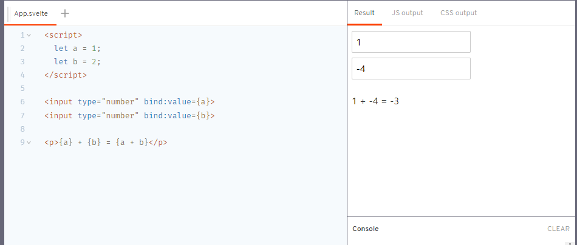

## 더 적은 코드를 쓰세요

신경 쓰지 않는 가장 중요한 지표

---

https://svelte.dev/blog/write-less-code

[Rich Harris](https://twitter.com/Rich_Harris), 2019년 4월 20일

모든 코드는 버그가 있습니다. 그러니까 더 많은 코드를 쓸 수록 앱이 버그를 가질 확률이 높아지는 거죠.

더 많은 코드를 쓰는 건 더 많은 시간이 듭니다. 그러니까, 최적화, 훌륭한 기능 갖추기, 또는 밖에 나가 놀기 같은데 시간을 못 쓰고 노트북을 쳐다보며 허리나 구부리고 있게 되는 거죠.

실제로 [프로젝트 개발 시간](https://blog.codinghorror.com/diseconomies-of-scale-and-lines-of-code/)과 [버그의 갯수](https://www.mayerdan.com/ruby/2012/11/11/bugs-per-line-of-code-ratio)는 코드 크기에 일차적으로 비례하는 게 아니라 이차적으로 비례(quadratically)한다고 널리 알려져 있습니다. 10줄의 PR은 100줄의 PR보다 더 엄격한 정밀조사가 이루어집니다는 직관을 이끌어냅니다. 주어진 모듈이 너무 커서 한 화면에 맞지 않는다면 그 것을 이해하려는 인지적인 노력이 급증할 것입니다. 리팩토링하고 주석을 추가하며 우리는 이런 문제를 해결해보려고 하지만 결국 더 많은 코드를 쓰게 될 뿐입니다. 끔찍한 순환입니다.

우리는 퍼포먼스 수치, 번들링 사이즈, 그리고 측정할 수 있는 모든 것에 집착하지만 우리가 작성하는 코드의 양에는 신경을 쓰지 않습니다.

### 가독성은 중요하다.

나는 가독성을 희생하면서 '똑똑한' 트릭을 사용해 코드를 최소한의 형태로 만들라고 하는 게 아닙니다. 코드 줄 수를 줄이는 게 가치 있는 목표라고 말하는 것도 아닙니다. 그런 것들은 아래처럼 가독성 있는 코드를 바꿔버릴 수 있습니다.

```js
for (let i = 0; i <= 100; i += 1) {
  if (i % 2 === 0) {
    console.log(`${i} is even`);
  }
}
```

아래처럼 말이죠...

```js
for (let i = 0; i <= 100; i += 1) if (i % 2 === 0) console.log(`${i} is even`);
```

대신 자연스레 코드를 덜 작성할 수 있는 언어와 패턴을 사용해야한다고 주장하는 겁니다.

### 그래요, Svelte입니다.

써야할 코드의 양을 줄이는 건 Svelte의 명시적인 목표입니다. 이를 설명하기 위해 React, Vue, 그리고 Svelte로 구현된 매우 간단한 컴포넌트를 살펴봅시다. 첫째로, Svelte입니다.



React에선 어떨까요? 아래와 같을 것입니다.

```js
import React, { useState } from 'react';

export default () => {
	const [a, setA] = useState(1);
	const [b, setB] = useState(2);

	function handleChangeA(event) {
		setA(+event.target.value);
	}

	function handleChangeB(event) {
		setB(+event.target.value);
	}

	return (
		<div>
			<input type="number" value={a} onChange={handleChangeA}/>
			<input type="number" value={b} onChange={handleChangeB}/>

			<p>{a} + {b} = {a + b}</p>
		</div>
	);
};
```

Vue에서는 이렇겠죠.

```js
<template>
	<div>
		<input type="number" v-model.number="a">
		<input type="number" v-model.number="b">

		<p>{{a}} + {{b}} = {{a + b}}</p>
	</div>
</template>

<script>
	export default {
		data: function() {
			return {
				a: 1,
				b: 2
			};
		}
	};
</script>
```

React에선 422개의 문자가 쓰였고, Vue에서는 263개의 문자가 쓰였습니다. Svelte에서는 고작 145문자로 이를 해결했습니다. React 버전은 말 그대로 세 배 더 큰 거죠.

> 터미널에서 `pbpaste | wc -c`를 돌려 복붙한 걸 세었습니다.

이렇게 명확히 차이가 나는 건 예삿일이 아닙니다. 내 경험상 React 컴포넌트는 Svelte보다 보통 40% 더 큽니다. 생각을 좀 더 명확하게 표현할 수 있는 Svelte의 설계 특징을 알아봅시다.

### 최상위 엘레멘트

Svelte에서 컴포넌트는 원하는만큼 최상위 엘레멘트를 가질 수 있습니다. React와 Vue에서 컴포넌트는 반드시 하나의 최상위 엘레멘트를 가집니다. React의 경우 두 개의 탑레벨 엘레멘트를 리턴하는 함수 컴포넌트는 문법적으로 유효하지 않은 코드입니다. (`<div>`대신 Fragment(`<>`)를 사용할 수도 있지만 기본적인 건 똑같고 여전히 추가적인 들여쓰기가 필요합니다.)

Vue에서 마크업은 `<template>` 엘레멘트로 감싸져야합니다. 예전에 이 게 불필요하다고 말했었습니다.

### 바인딩

React에서 입력 이벤트에 대해 스스로 반응해야합니다.

```js
function handleChangeA(event) {
	setA(+event.target.value);
}
```

이 건 화면상에 쓸데 없이 공간만 차지할 뿐인 지루한 연결 작업일 뿐만 아니라 추가적인 버그의 온상지도 될 수 있습니다. 개념적으로 input의 값은 `a`의 값에 바인딩 되어있습니다. 그 역도 마찬가지죠. 하지만 그 관계가 명확하게 표현되지 않습니다. 밀접한 둘(input과 a)이 존재하지만 실질적으로는 나눠진 코드 조각인 거죠(이벤트 핸들러와 `value={a}` prop). 그뿐만이 아니라 우리는 스트링 값을 + 연산자에 맞춰 강제(coerce)하고 있습니다. 원래 값대로라면 `2+2`는 `22`가 되어야하는데 대신 `4`가 되는 거죠.

Svelte처럼 Vue는 바인딩을 표현하는 방식이 있습니다. `v-model` 어트리뷰트입니다. 하지만 우리는 `v-model.number`가 숫자값임에도 조심스레 그를 다뤄야합니다. 


### 상태

Svelte에선 로컬 컴포넌트의 상태를 할당 연산으로 업데이트할 수 있습니다.

```js
let count = 0;

function increment() {
	count += 1;
}
```

React에서 `useState` hook을 사용합니다.

```js
const [count, setCount] = useState(0);

function increment() {
	setCount(count + 1);
}
```

더 번잡합니다. 정확히 같은 컨셉을 표현하지만 글자가 60% 더 많습니다. 코드를 읽을 때 저자의 의도를 파악하기 위해 더 많은 노력이 필요합니다.

반면 Vue에는 로컬 상태에 해당하는 프로퍼티를 가진 리터럴 오브젝트를 리턴하는 `data` 함수가 있습니다. 이 함수는 default export로 처리됩니다. 헬퍼 함수와 자식 컴포넌트 같은 것들처럼 간단히 import 되고 템플릿 내에서 쓰일 수 없습니다. 대신 default export의 정확한 부분에 그 것들을 달아서 등록을 해야만 합니다.

### 보일러플레이트에게 죽음을

Svelte에게는 최소한의 것들로 UI를 만들게 도울 방법이 있습니다. 가령, [reactive declarations](https://svelte.dev/tutorial/reactive-declarations) 같은 것들은 보일러플레이트 없이 React의 `useMemo`,`useCallbkac`, 그리고 `useEffect`들이 하는 일을 합니다(상태가 변할 때 배열과 인라인 함수를 만드는데 있어 가비지 컬렉터의 오버헤드 또한 없습니다)

어떻게 하냐구요? 다른 제약사항들을 선택했습니다. Svelte가 컴파일러이기 때문에 js의 특이한 점들에 목을 맬 필요가 없습니다. 우린 언어의 시맨틱스에 맞추는 게 아니라 컴포넌트 작성 경험을 설계했습니다. 역설적으로 더 자연스러운 코드가 되었습니다. 예를 들자면 프록시나 hook을 쓰는 것보다는 그냥 변수를 쓰는 게 더 자연스럽습니다. 물론 다 퍼포먼스가 뛰어난 앱을 만드는 것도 빼놓지 않구요.
